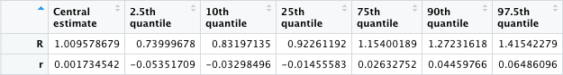

# Recent R estimation for the UK
 
This code uses [PHE case data](https://coronavirus.data.gov.uk/details/cases) to produce an estimate of the UK R rate at the most recent date possible.

The method follows that of [this paper](https://doi.org/10.1016/S2589-7500(20)30241-7), back-calculating the timing of new infections from reported cases, and calculating R using a Bayesian method based heavily on that of the R package [EpiEstim](https://cran.r-project.org/web/packages/EpiEstim/index.html). We also convert this to a measure of the growth rate r, following [Wallinga and Lipsitch](https://royalsocietypublishing.org/doi/10.1098/rspb.2006.3754).

Historic estimates of R for England and Wales using this method, broken down by region and local authority, are available from [Local Covid Tracker](https://bdi-pathogens.shinyapps.io/LocalCovidTracker/), which is updated daily and for which the code is available [on GitHub](https://github.com/BDI-pathogens/LocalCovidTracker).

The recent estimate provided by the code in this repository has been optimised so that, with the contemporaneously available data, it has closely matched the historic estimates throughout 2021. However, it will always be susceptible to biases such as underestimation if there are unusual reporting delays, and it should be used with caution and with attention to the reporting context. For example, in April 2021 Wales moved to a six-day reporting schedule, so estimates obtained between approximately 4pm on a Saturday and 4pm on a Sunday will necessarily be slight underestimates under this schedule.

Our estimate is a weighted average of R estimates across all Lower Tier Local Authorities in the UK. We weight the estimates by local nowcasts (a measure of R and incidence) so that areas with more cases and growing epidemics are emphasised. It is important to note that [a national estimate becomes difficult to interpret when case numbers are low](https://michellekendall.github.io/2021/03/18/interpreting-R-at-low-case-count/).

To use, simply clone this repository and run the code in `R/UK_R_estimate.R` which will produce an output like this:

``
[1] "Estimates for 11 April 2021:"
``

